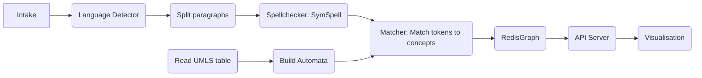

```mermaid 
	graph LR;
      A[Intake]-->B(Language Detector);
      B-->C(Split paragraphs);
      C-->D(Spellchecker: SymSpell);
      D-->F(Matcher: Match tokens to concepts);
      F-->G(RedisGraph);
      G-->H(API Server);
      H-->I(Visualisation)
      J(Build Automata)-->F;
      K(Read UMLS table)-->J;
```	